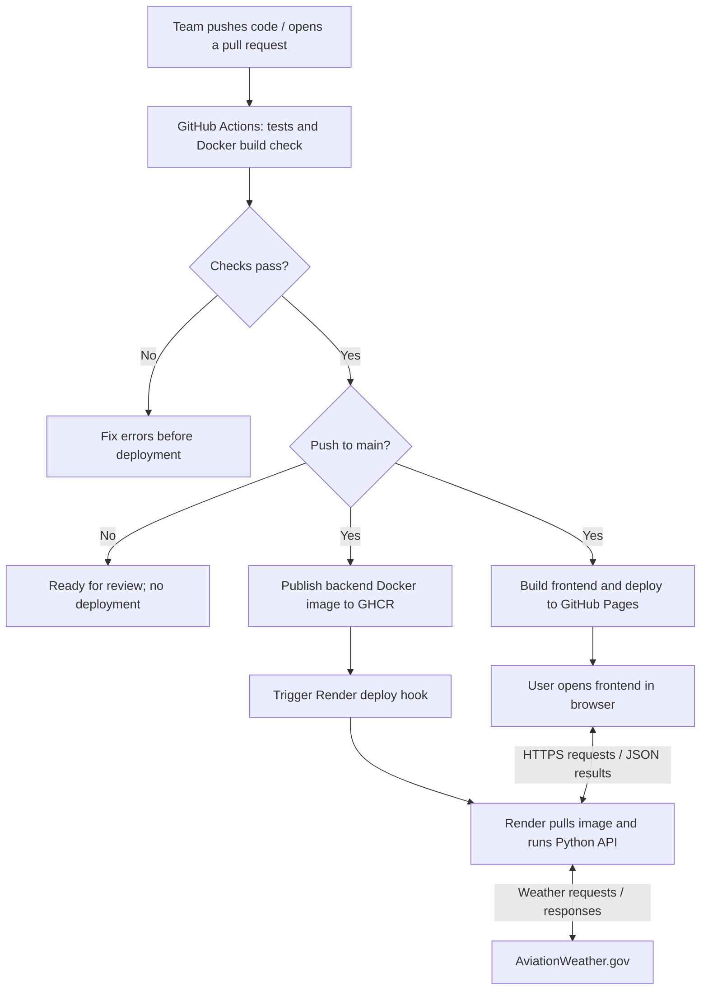

# Cross-Country Flight Planner
### CS 4273 Capstone Design Project (Fall 2026) - Group D

**Last Updated:** September 30, 2026

**Tickets:** 2 — Technology Identification; CAPD-30 — Backend Hosting and Deployment Workflow
> Reflects the team's current project scope, technology decisions, key feature and unit-test examples, goals, and development plan.

## Team Members
- Reese Zimmermann — Product Owner
- Avinash Kandadi — Sprint Master 1
- Sahith Gondi — Sprint Master 2
- Sean Ropp — Sprint Master 3
- Elise Alvarado — Sprint Master 4
- Nic Grounds — Mentor / Client

## Project Description

The Flight Planner project is a software-based system designed to assist pilots with cross-country flight planning by replacing the traditional pen-and-paper process used.

Traditionally, pilots use paper navigation logs, aircraft performance information, weather data, route information, and tools such as the 
E6-B flight computer to determine factors including distance, flight time, fuel consumption, headings, waypoints, climb performance, and descent performance.

Beyond serving solely as a planning tool, the system is designed to double as a **learning and practice tool**, helping students and new pilots understand and work through the flight-planning process step-by-step, rather than simply producing a final number.

The goal of this project is to create a system intended to serve two purposes:

1. **Flight-planning assistance** — Help pilots organize the information and calculations involved in preparing a cross-country flight.
2. **Learning and practice** — Allow users to practice and better understand the calculations and decision-making involved in traditional flight planning.

The software is intended to support the pilot's decision-making process rather than replace official aviation resources or pilot judgment.

## Identified Technologies & Tools

| Technology | Purpose |
|---|---|
| **Python** | Primary programming language for implementing mathematical and data-processing logic for calculations involving flight time, fuel consumption, climb and descent performance, waypoint calculations, aircraft performance information, and weather information|
| **AviationWeather.gov / SkyVector.com APIs** | Live aviation weather data  [METAR](https://aviationweather.gov/api/data/metar) and [TAF](https://aviationweather.gov/api/data/taf) endpoints feed real wind, visibility, and forecast data into the planning calculations |
| **Docker** | Packages the Python backend and its dependencies into an image for consistent development and deployment |
| **GitHub Actions** | Runs automated tests and Docker build checks on pushes/PRs; planned deployment automation will publish images and trigger hosting updates after successful checks on `main` |
| **GitHub Container Registry (GHCR)** | Will store versioned backend Docker images built by GitHub Actions |
| **Render Web Service** | Will pull the backend image from GHCR and run the Python HTTP API at a public HTTPS URL |
| **GitHub Pages** | Will host the static frontend, which calls the Render backend from the user's browser |
| **Jira** | Project planning and task organization to track team progress |

### Learning Resources
- Python: [learnpython.org](https://www.learnpython.org/)
- GitHub Actions: [docs.github.com/en/actions](https://docs.github.com/en/actions)
- Docker: [Docker 101 Tutorial](https://www.docker.com/101-tutorial/)
- GHCR: [Publishing Docker images with GitHub Actions](https://docs.github.com/en/actions/tutorials/publish-packages/publish-docker-images)
- Render: [Deploy a prebuilt Docker image](https://render.com/docs/deploying-an-image)
- GitHub Pages: [What is GitHub Pages?](https://docs.github.com/en/pages/getting-started-with-github-pages/what-is-github-pages)
- Jira: [Atlassian Jira Getting Started Guide](https://www.atlassian.com/software/jira/guides/getting-started/introduction)
- Aviation weather data: aviationweather.gov / SkyVector.com

## Planned Hosting and Deployment Workflow

The frontend will be hosted on **GitHub Pages**, and the Python backend will run as a **Render Web Service**. **GitHub Container Registry (GHCR)** will store the backend Docker images. GitHub Actions will connect these services by testing changes, building and publishing images, and triggering deployment.

**Current status:** The repository has a Python CLI and CI jobs for unit tests and Docker builds. The HTTP API, frontend, image publishing, and hosting deployments still need to be implemented. Before deploying to Render, add an API layer (such as FastAPI) around the existing Python modules and change the container startup command to run an HTTP server instead of the interactive CLI.

### Deployment Steps

1. Team members push changes and open pull requests. GitHub Actions runs unit tests and checks that the Docker image builds.
2. After changes merge into `main` and checks pass, GitHub Actions publishes the backend image to `ghcr.io/ou-cs-4273-capstone-grounds/fa26-flightplanner`, tagged with the commit SHA.
3. GitHub Actions calls a Render deploy hook to deploy the published image. Render pulls it from GHCR and starts the backend. Publishing a new image alone does not trigger a Render deployment.
4. The frontend is built and deployed to GitHub Pages after successful checks on `main`.
5. Users open the frontend in their browser. It sends HTTPS requests to the Render API, which performs calculations or fetches aviation weather and returns JSON results.

### Workflow Diagram



### Hosting Configuration

- **Image publishing:** Use the GitHub Actions `GITHUB_TOKEN` with `contents: read` and `packages: write`. Build a `linux/amd64` image for Render and deploy a specific image digest or commit tag so releases are traceable.
- **Render:** Select **Web Service**, then **Existing Image**, and supply the GHCR image URL. If the image is private, configure a registry credential with `read:packages`. Store the Render deploy hook URL as a GitHub Actions secret.
- **Backend:** Listen on `0.0.0.0` and the port configured by Render. Allow the frontend origin, `https://ou-cs-4273-capstone-grounds.github.io`, through CORS.
- **Frontend:** Configure the Render API's HTTPS URL and the GitHub Pages project base path, `/fa26-flightplanner/`. Keep credentials in backend environment variables or GitHub Actions secrets.

## Key Project Feature: Density Altitude Calculation

One of the calculations the system replaces from the E6-B and paper performance charts is **density altitude** the pressure altitude corrected for temperature. It's the single input that nearly every other performance chart in the aircraft's POH depends on: rate of climb, true airspeed, takeoff/landing distance, and range are all plotted against density altitude.

**Inputs:**
- Pressure Altitude (PA) — altitude read off the altimeter when set to 29.92" Hg
- Outside Air Temperature (OAT), in °C

**Output:** Density Altitude (ft) — used downstream by the system to look up expected climb rate, true airspeed, takeoff/landing distance, and fuel range for the planned flight.

**Why this feature matters:** Nearly every aircraft performance figure (climb rate, takeoff roll, landing distance, range) is only accurate once corrected for density altitude. Getting this calculation right is important for the rest of the performance-planning features build on.

---
## Unit Test Examples

The following unit tests represent the **Density Altitude Calculation** feature using the same inputs and expected output in Python, JavaScript, and Java.

### Python

```python
import pytest
from performance import calculate_density_altitude  # not implemented yet

def test_calculate_density_altitude_basic():
    result = calculate_density_altitude(
        pressure_altitude=2500,
        oat_celsius=25
    )

    assert result == pytest.approx(4300, abs=1)
```

### JavaScript

```javascript
import { calculateDensityAltitude } from '../performance';

test('calculateDensityAltitude returns correct density altitude', () => {
  const result = calculateDensityAltitude(2500, 25);

  expect(result).toBeCloseTo(4300, 0);
});
```

### Java

```java
import org.junit.jupiter.api.Test;
import static org.junit.jupiter.api.Assertions.assertEquals;

class PerformanceTest {

    @Test
    void calculateDensityAltitude_returnsExpectedValue() {
        double result = Performance.calculateDensityAltitude(2500, 25);

        assertEquals(4300, result, 1);
    }
}
```

### Test Scenario

- **Pressure Altitude:** 2,500 ft
- **Outside Air Temperature:** 25°C
- **Expected Density Altitude:** approximately 4,300 ft

All three tests evaluate the same Density Altitude Calculation feature using the same inputs and expected result. The calculation function has not yet been implemented; these tests define the expected behavior for future development.

---


## Goals & Progress Plan

**Overall goal:** Deliver a working flight-planning tool by the end of the semester that a pilot or student could realistically use to plan a cross-country flight, with wind, fuel, distance, and waypoint calculations pulling from live aviation weather data.

**Progress plan (tracked via Jira, tickets scoped per sprint):**

1. **Domain understanding & tech setup**  — finalize tech stack, set up Docker environment, connect to aviationweather.gov endpoints, confirm formulas for wind triangle/fuel/distance calculations.
2. **Core calculation engine** — implement and unit-test wind correction angle, ground speed, fuel burn, and distance/waypoint calculations in Python.
3. **Weather data integration** — pull live METAR/TAF data from aviationweather.gov and feed it into the calculation engine.
4. **CI/CD pipeline** — set up GitHub Actions to run the test suite automatically on every push/PR.
5. **User-facing interface** — build a simple UI for entering a route and viewing the full flight plan output.
6. **Practice/learning mode** — add a mode that walks a user through the planning process step-by-step rather than just showing final results.
7. **Review & polish** — incorporate feedback from our mentor, refine documentation and test coverage.

## Repository

**GitHub Repository:**  
https://github.com/OU-CS-4273-Capstone-Grounds/fa26-flightplanner
